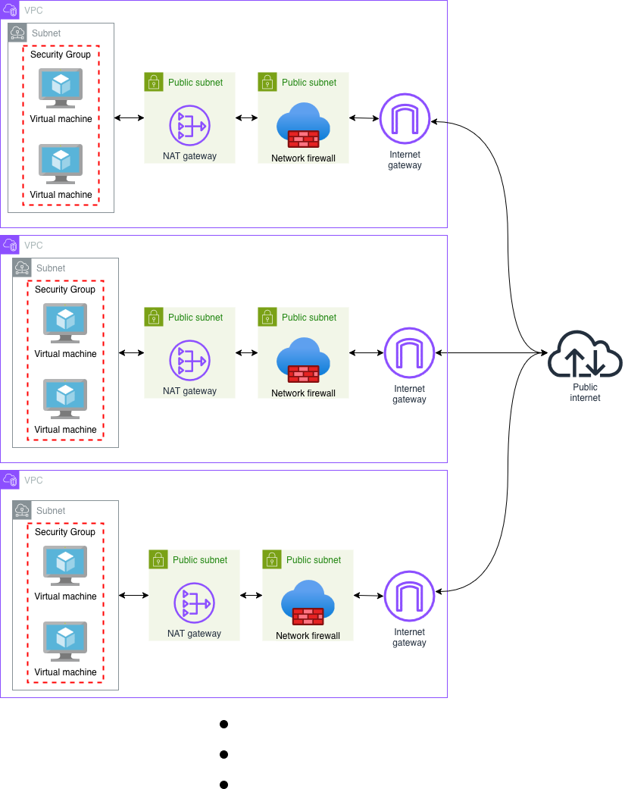
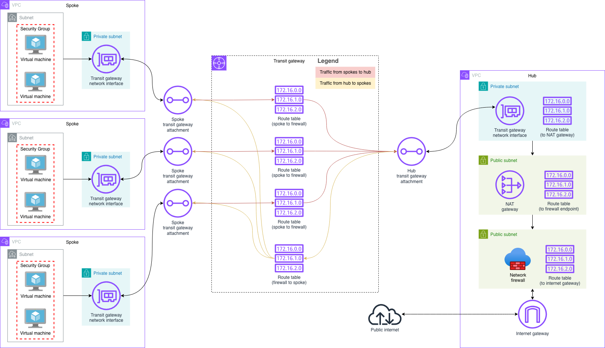
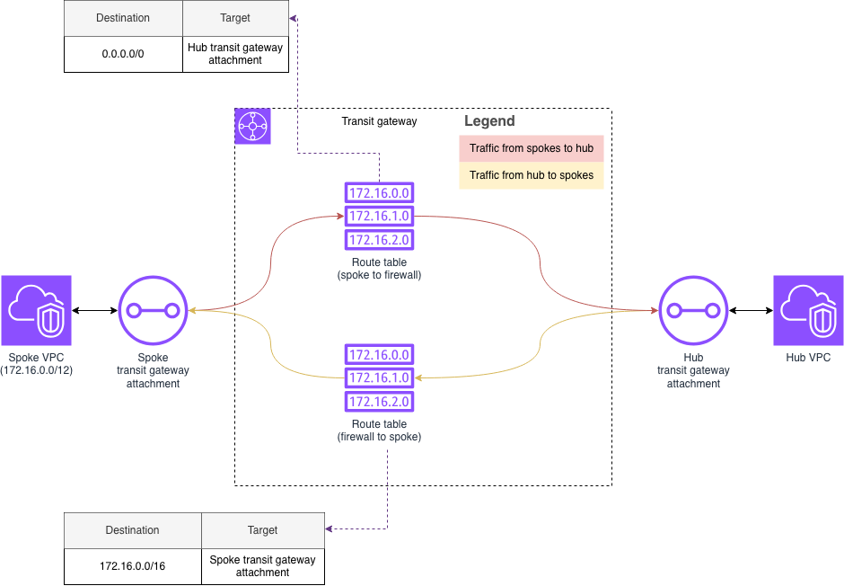
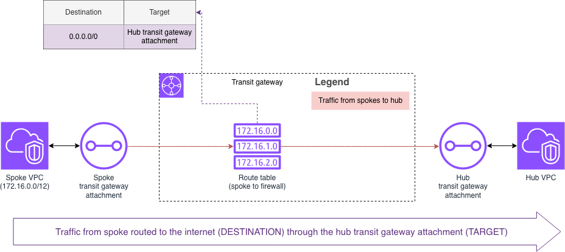
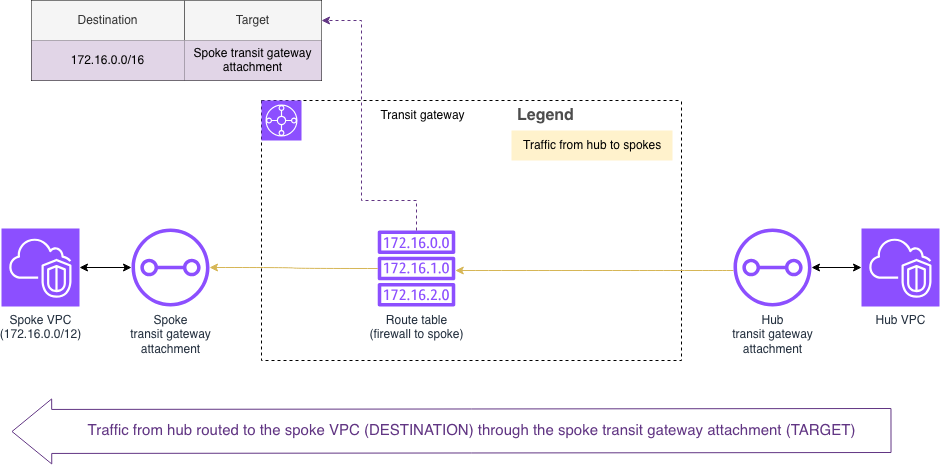
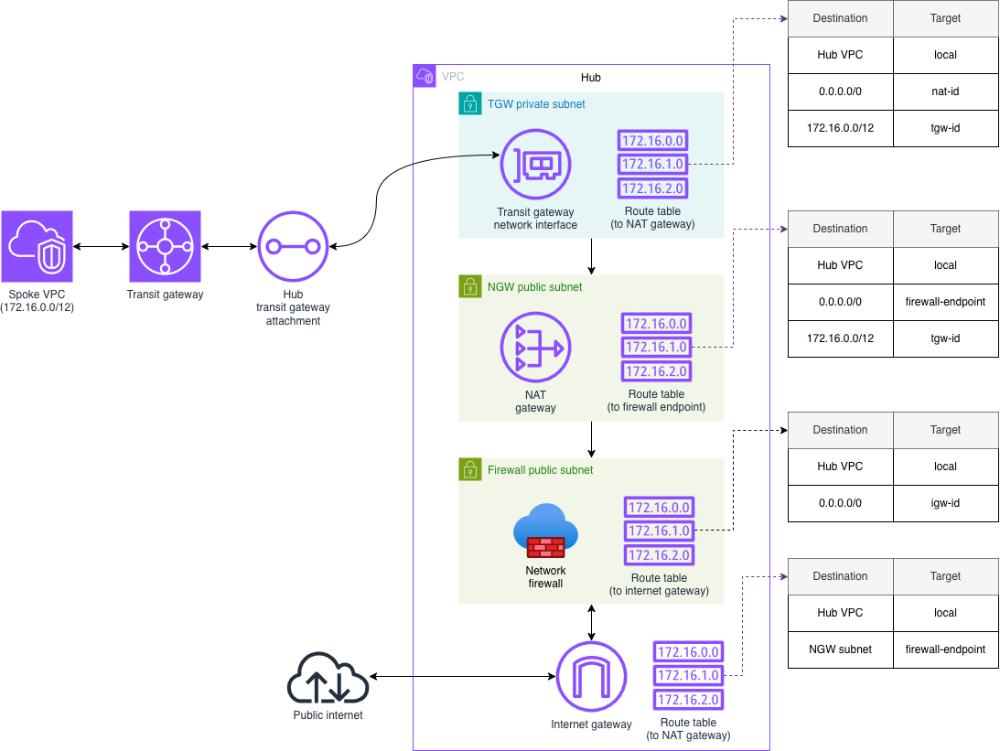
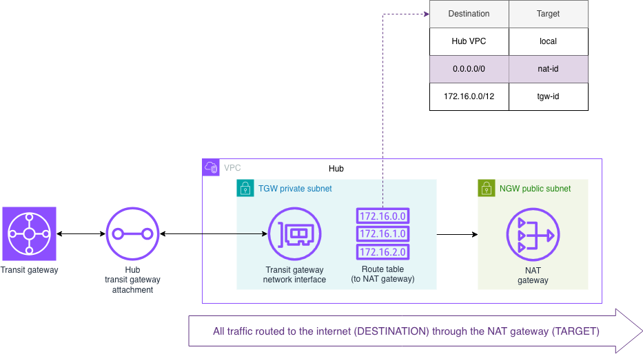
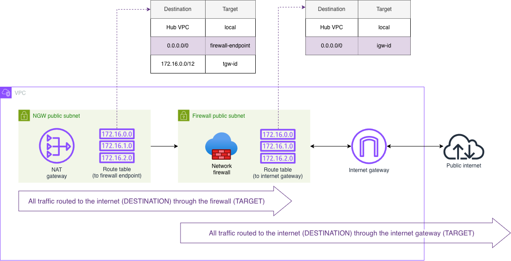
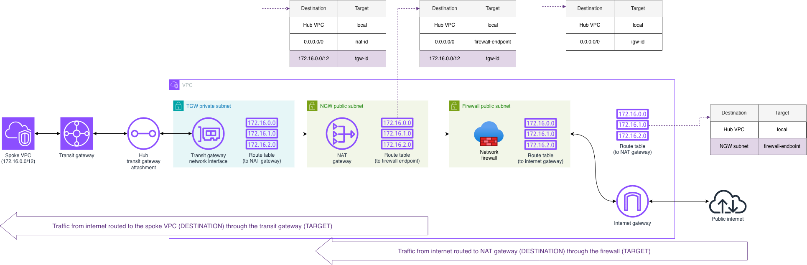
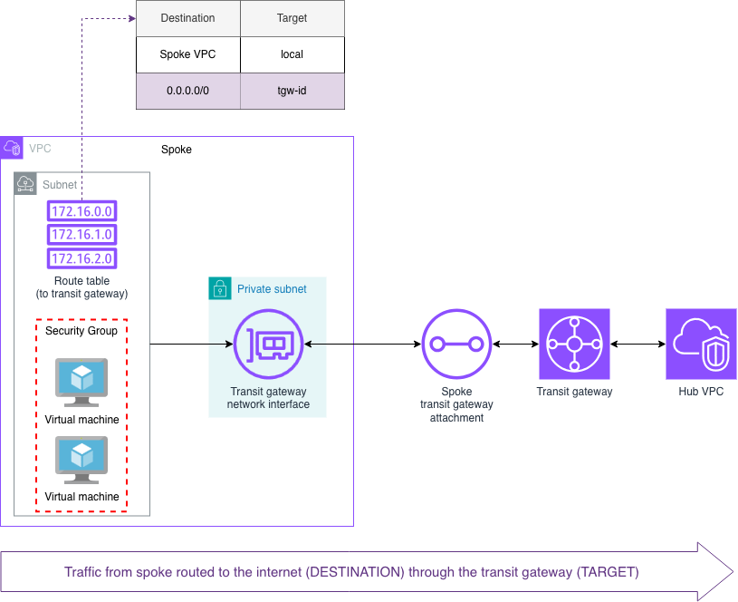

## Introduction

Network architecture patterns are reliable, industry-standard ways to manage connections between computing devices. They give you an example to follow as you set up your networking infrastructure. Two architecture pattern categories you can use are: _decentralized_ or _centralized_.

In the cloud, a best practice is a centralized network architecture called the [_hub-and-spoke model_](https://learn.microsoft.com/en-us/azure/architecture/networking/architecture/hub-spoke). This pattern directs traffic between many networks (spokes) and one central network (hub). The hub network shares its resources, like a [network firewall](https://docs.aws.amazon.com/network-firewall/latest/developerguide/what-is-aws-network-firewall.html), a [NAT gateway](https://docs.aws.amazon.com/vpc/latest/userguide/vpc-nat-gateway.html), and an internet gateway, with all the spoke networks. As a company expands its cloud infrastructure footprint, consolidated resources save money and lower the threat of exposing information.

In this article, you'll learn:

* Why a centralized architecture, like the hub-and-spoke model, is a best practice in the cloud.
* How traffic moves between VPCs in a hub-and-spoke model.
* How a hub-and-spoke model saves your organization money by sharing a single network firewall, NAT gateway, and internet gateway with your entire network.

## Decentralized VPC architecture

In a decentralized VPC architecture, each application is completely isolated. This means each has its own infrastructure, security settings, and internet exposure points. To add a new application to the network, you must recreate all these components. While this may suit organizations with one, two, or maybe three applications, it's cumbersome to manage and costly to maintain as the organization scales.

For example, consider an organization with only one application. They create a single VPC with:

* A NAT gateway
* A network firewall
* An internet gateway

After some time, they create a new application. To have the same security as their first application, they create a VPC with the same components. Later, they replicate their VPC again for a third application. As the organization scales and creates more applications, they add more infrastructure to their AWS environment.

<figure>
    
    <figcaption>
        Figure 1: Arbitrary number of decentralized AWS VPCs connected to the public internet
    </figcaption>
</figure>

This infrastructure duplication is expensive. For a single VPC in the diagram above, it [costs $322 USD to process just 10 GB of data per month](https://calculator.aws/#/estimate?id=b12e071c14c1cdf95fff8d2618465fbbfe63545b). For three VPCs, the costs triple. And, its multiple exposures to the internet make it less secure. Firewall policies and security measures must be replicated across every VPC.

As an organization scales, then, it must consider how it manages its growing network. The best way to do that is to switch to a centralized VPC architecture, specifically a hub-and-spoke model.

## Centralized (hub-and-spoke) VPC architecture

In a centralized VPC architecture, like the hub-and-spoke model, each application (spokes) connects to a central network (hub). The hub network shares a single set of networking infrastructure with all the spoke networks. This shared infrastructure significantly reduces an organization's overall cloud costs. A hub-and-spoke model is more secure, as well, because it has only one internet exposure point to protect.

For example, in the following diagram, a hub VPC in a hub-and-spoke architecture shares its firewall, NAT gateway, and internet gateway with all three spoke VPCs.

<figure>
    
    <figcaption>
        Figure 2: AWS networks connected to the public internet through a central, firewall-protected hub network
    </figcaption>
</figure>

In the following sections, we'll learn how the spokes communicate with the hub, and the hub with each spoke, in detail.

## Inter-VPC traffic with AWS Transit Gateway

In AWS, a hub-and-spoke network model is powered by [AWS Transit Gateway](https://aws.amazon.com/transit-gateway/). AWS Transit Gateway connects multiple VPCs to a central hub. You can connect a single transit gateway hub to [5,000 spoke VPCs](https://docs.aws.amazon.com/vpc/latest/tgw/transit-gateway-quotas.html) with transit gateway attachments. You define how traffic moves through these attachments with VPC route tables.

A VPC route table is a set of rules, called _routes_, that determine where to send incoming traffic. Route tables have two main components:

<dl>
  <dt>Destination</dt>
  <dd>The IP address range where you want traffic to go. For example, <code>172.16.0.0/16</code>.</dd>
  <dt>Target</dt>
  <dd>The connection or route through which to send traffic. For example, an internet gateway or transit gateway attachment. The default route through a VPC is the <strong>local</strong> route. It lets resources within a VPC communicate through private IP addresses.</dd>
</dl>

 
<svg height="24" class="octicon octicon-light-bulb" viewbox="0 0 24 24" version="1.1" width="24" aria-hidden="true"><path d="M12 2.5c-3.81 0-6.5 2.743-6.5 6.119 0 1.536.632 2.572 1.425 3.56.172.215.347.422.527.635l.096.112c.21.25.427.508.63.774.404.531.783 1.128.995 1.834a.75.75 0 0 1-1.436.432c-.138-.46-.397-.89-.753-1.357a18.111 18.111 0 0 0-.582-.714l-.092-.11c-.18-.212-.37-.436-.555-.667C4.87 12.016 4 10.651 4 8.618 4 4.363 7.415 1 12 1s8 3.362 8 7.619c0 2.032-.87 3.397-1.755 4.5-.185.23-.375.454-.555.667l-.092.109c-.21.248-.405.481-.582.714-.356.467-.615.898-.753 1.357a.751.751 0 0 1-1.437-.432c.213-.706.592-1.303.997-1.834.202-.266.419-.524.63-.774l.095-.112c.18-.213.355-.42.527-.634.793-.99 1.425-2.025 1.425-3.561C18.5 5.243 15.81 2.5 12 2.5ZM8.75 18h6.5a.75.75 0 0 1 0 1.5h-6.5a.75.75 0 0 1 0-1.5Zm.75 3.75a.75.75 0 0 1 .75-.75h3.5a.75.75 0 0 1 0 1.5h-3.5a.75.75 0 0 1-.75-.75Z"></path></svg>
 
If the route table’s destination is <code class="language-plaintext highlighter-rouge">0.0.0.0/0</code>, it routes all traffic to the target.

Route tables direct all traffic in to, out of, and within a hub-and-spoke network.

Now, let's explore how route tables move traffic:

* Between the hub and a spoke VPCs.
* Within the hub VPC.
* Within a spoke VPC.

### Traffic between the hub VPC and a spoke VPC

Transit gateway route tables transfer traffic from one VPC to another.

* One route table directs traffic from the firewall to the each spoke.
* One route table for each spoke VPC directs traffic from the spoke to the firewall.

The following diagram shows how route tables direct the traffic between a hub and spoke VPC:

<figure>
    
    <figcaption>Figure 3: Traffic flow between the hub VPC and a spoke VPC</figcaption>
</figure>

#### Internet-bound traffic from spoke VPC to hub VPC

When a spoke VPC sends internet-bound traffic to the transit gateway:

1. The traffic enters the transit gateway through the spoke transit gateway attachment.
1. A transit gateway route table sends the traffic to the hub transit gateway attachment.

The following diagram shows traffic from a spoke VPC to the hub:

<figure>
    
    <figcaption>Figure 4: Traffic flow from spoke VPC to hub VPC</figcaption>
</figure>

#### Spoke-bound traffic from hub VPC to spoke VPC

When the hub VPC sends traffic back to the spoke VPC through the transit gateway:

1. The traffic enters the transit gateway through the hub transit gateway attachment.
1. A transit gateway route table sends the traffic to the spoke transit gateway attachment.

The following diagram shows traffic from a hub VPC to a spoke:

<figure>
    
    <figcaption>Figure 5: Traffic flow from hub VPC to spoke VPC</figcaption>
</figure>

### Traffic within a hub VPC

The hub VPC has the network's firewall and sole internet connection. Route tables move this traffic from a spoke's VPC, to the internet, and back to the spoke.

The following diagram shows how route tables move traffic within the hub VPC. In this example, the spoke VPC's IP address range is 172.16.0.0/12. Traffic moves from the spoke to the internet through the transit gateway and network firewall:

<figure>
    
    <figcaption>Figure 6: Traffic flow within the hub VPC</figcaption>
</figure>

#### Internet-bound traffic through the hub VPC

When a spoke VPC sends internet-bound traffic to the hub VPC:

1. The traffic enters the hub VPC from the hub transit gateway attachment through a network interface.
1. The interface's associated route table sends it to a NAT gateway.

The following diagram shows traffic from a spoke VPC as it enters the hub:

<figure>
    
    <figcaption>Figure 7: Internet-bound traffic routed through a NAT gateway</figcaption>
</figure>

The NAT gateway is the hub VPC's connection to the network firewall and the public internet. [NAT gateways](https://docs.aws.amazon.com/vpc/latest/userguide/vpc-nat-gateway.html) add extra security to internet connections. It translates a VPC subnet's private IP address to a public one.

When the internet-bound traffic reaches the NAT gateway:

1. The gateway's associated route table sends it to the network firewall.
1. The firewall checks its firewall policy for the intended internet address.

    * If the traffic is allowed, the firewall's associated route table sends the traffic to the internet gateway.
    * Otherwise, the firewall blocks the traffic from moving forward.

The following diagram shows traffic as it's routed to the public internet:

<figure>
    
    <figcaption>Figure 8: Internet-bound traffic routed through a network firewall</figcaption>
</figure>

#### Spoke-bound traffic through the hub VPC

When the internet sends traffic back to the hub VPC:

1. The traffic enters the hub VPC from the internet through the network firewall.
1. The firewall checks its firewall policy for the incoming internet address.

    * If the traffic is allowed, the firewall's associated route table sends the traffic to the NAT gateway subnet.
    * Otherwise, the firewall blocks the traffic from moving forward.

1. The NAT gateway translates the incoming public IP address to the spoke VPC's private IP address range.
1. The NAT gateway's associated route table sends the traffic back to the spoke through the network interface and transit gateway.

The following diagram shows traffic as it's routed from the public internet back to the spoke VPC:

<figure>
    
    <figcaption>Figure 9: Spoke-bound traffic routed through a network firewall and transit gateway</figcaption>
</figure>

### Spoke VPC

A spoke VPC is an individual node in the network. A spoke VPC might serve an application in the same AWS account as the hub VPC or in another account from a company's organization.

In the spoke VPC:

1. A route table sends all internet-bound traffic to the transit gateway.
1. A network interface and a transit gateway attachment connect it to the transit gateway.

The following diagram shows how route tables move traffic from a spoke VPC to the hub VPC.

<figure>
    
    <figcaption>Figure 10: Traffic flow from a single spoke VPC</figcaption>
</figure>

## Conclusion

In this article, we saw how:

* The hub-and-spoke model uses AWS Transit Gateways to connect multiple VPCs to a central hub.
* VPC route tables direct traffic flow between all VPCs in the network.
* A single NAT gateway and a network firewall in the hub VPC protect all the spoke VPCs in the network.

The hub-and-spoke network model is a powerful way to manage your cloud networks easily and efficiently. It lets you scale your applications without the cost of additional security services, like firewalls or NAT gateways. Its flexibility lets you modify the architecture to fit your business requirements. For example, you can duplicate your hub VPC across multiple availability zones to improve the network's availability. A centralized network, like the hub-and-spoke model, gives you complete control over the entire system.

Check out the following resources to learn more about centralized networks or how to build your own hub-and-spoke model:

* [Deployment models for AWS Network Firewall](https://aws.amazon.com/blogs/networking-and-content-delivery/deployment-models-for-aws-network-firewall/)
* [Creating a single internet exit point from multiple VPCs using AWS Transit Gateway](https://aws.amazon.com/blogs/networking-and-content-delivery/creating-a-single-internet-exit-point-from-multiple-vpcs-using-aws-transit-gateway/)
* [Using the NAT gateway with AWS Network Firewall for centralized IPv4 egress](https://docs.aws.amazon.com/whitepapers/latest/building-scalable-secure-multi-vpc-network-infrastructure/using-nat-gateway-with-firewall.html)
* [Architecture with an internet gateway and a NAT gateway using AWS Network Firewall](https://docs.aws.amazon.com/network-firewall/latest/developerguide/arch-igw-ngw.html)
