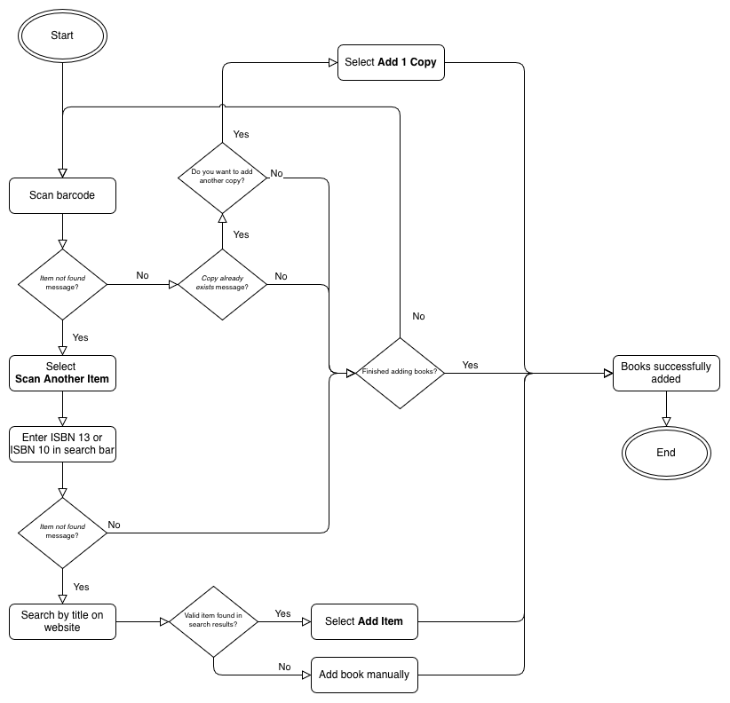

= Scottinez Libib collection guide
:page-last_modified_at: 2025-12-07
:page-categories: [portfolio, how-to]
:url-libib-app: https://apps.apple.com/us/app/libib/id721908216
:url-libib: https://www.libib.com
:icons: font

== Introduction

This guide describes how to manage books in the Scottinez Libib collection.

IMPORTANT: You need the {url-libib-app}[Libib mobile app] to use this guide.

== Add a new book

Add new books into Libib as you get them. You can do so in four ways:

* Search by barcode
* Search by ISBN 13 or ISBN 10.
* Search by title.
* Create a new book manually.

If one way fails, try another. See the following flowchart for reference.

.New book process flowchart

=== Search by barcode

Scanning the barcode is the easiest way to add a new book.

To add a book by its barcode:

. Remove stickers or other obstructions from the barcode.
. Open the Libib mobile app and select *Scottinez Books*.
. Select  and then select *Barcode*.
. Select *Book*.
. Center the book's barcode on your screen using your phone's camera. Libib automatically captures the barcode.
. Select *Add another* to add another book or select *Done* to save your changes.

A green confirmation message appears along the top of the screen.

=== Search by ISBN 13 or ISBN 10

If the book doesn't have a barcode or if you can't scan it, search for the book by its ISBN 13 or ISBN 10.

ISBN 13:: The ISBN 13 is an identification number with 13 digits that starts with _978_ or _979_. Books printed after 2007 only have an ISBN 13.
ISBN 10:: The ISBN 10 is an identification number with 10 digits that starts with _0_ or _1_. Books printed before 2007 have both an ISBN 10 and an ISBN 13, but may only show the ISBN 10.

To search for a book by its ISBN 13 or ISBN 10:

. Find the ISBN 13 or ISBN 10 on the book's copyright page or near the barcode.
. Open the Libib mobile app and select *Scottinez Books*.
. Select  and then select *Barcode*.
. Select *Book*.
. Enter the ISBN 13 or ISBN 10 in the search bar along the top of the screen and then tap *return*.
. Select *Add another* to add another book or select *Done* to save your changes.

A green confirmation message appears along the top of the screen.

=== Search by title

If the book doesn't have a printed ISBN or the search doesn't return results, search for the book by its title.

IMPORTANT: You must use the website to search for a book by title.

. Go to {url-libib}[Libib.com] and log in to the _greagancatalog@protonmail.com_ account.
. In the sidebar menu, select *Add Items*.
. Under _Select Item Type_, choose *Book*.
. Enter the book's name in the search bar under _Search for Books_ and then select *Search*.
. Find the entry that matches the book and then select *Add Item*.
+
--
Check the following attributes to find the closest match:

* Title
* Cover image
* Author
* Publish year
* Number of pages
* Publisher (in parentheses next to number of pages)
--

A green confirmation message appears along the top of the screen.

In hte sidebar menu, select *Library* to return to the library.

=== Create a new book manually

If you can't find the book by its barcode, ISBN 13 or 10, or title, create a new book manually. Only create a new book if none of the other search methods work.

To create a new book:

. Open the Libib mobile app and select *Scottinez Books*.
. Select  and then select *Manual*.
. Select *Book*.
. Fill out the Manual Entry form and then select *Submit*. The following table describes each field in the form.
+
--
.Manual Entry form
|===
|Field |Description |Required?

s|Title
|The book's name.
s|Yes

s|Authors (comma separate)
|A comma-separated list of the book's authors.
s|Yes

s|Description
|The brief description of the book on the inside flap or back cover.
s|Yes

s|Price
|The book's price.
|No

s|Publisher
|The book's publisher as listed on the copyright page or spine.
s|Yes

s|Publish Date (YYYY MM DD)
|The book's publish date or year as listed on the copyright page.
s|Yes (year only)

s|ISBN 13
|The book's ISBN 13 code.
|No

s|ISBN 10
|The book's ISBN 10 code.
|No

s|Pages
|The book's total page count, including back matter (notes, bibliography, or index).
s|Yes (except for audio books)
|===
--

A green confirmation message appears along the top of the screen.

Select *Library* to return to the library.

== Edit an existing book

You can edit details of books in your collection.

=== Edit a book's properties

. Open the Libib mobile app and select *Scottinez Books*.
. Select the book that you want to edit.
. Select  and then select *Edit*.
. Make the required changes and then select *Save*.

A green confirmation message appears along the top of the screen.

Select *Back* and then select *Back* again to return to the library.

=== Edit a book's image

. Open the Libib mobile app and select *Scottinez Books*.
. Select the book that you want to edit.
. Select  and then select *Image*.
** Select *Photo Library* to choose a photo from your phone. Give Libib access to view your photos, if asked.
** Select *Camera* to take a new photo. Select *Use Photo* to confirm the photo.
. Select .

A green confirmation message appears along the top of the screen.

Select *Back* and then select *Back* again to return to the library.

== Delete a book

Delete books from Libib as you dispose of them.

To delete a book:

. Open the Libib mobile app and select *Scottinez Books*.
. Select the book that you want to remove.
. Select  and then select *Delete*.
. Select *Delete* again to confirm.

A green confirmation message appears along the top of the screen.

You're automatically returned to the library.

== Troubleshooting

[qanda]
I can't find the book by barcode, ISBN, or title::
If you can't find a book by barcode, ISBN, or title, you must create the book manually. See <<Create a new book manually>> for instructions.

I scanned a book that already exists in the collection::
When you scan a book that already exists in the collection, select *Done* to avoid adding an extra copy.

I need to adjust the number of copies of a book in the collection::
To adjust the number of copies of a book:

. Open the Libib mobile app and select *Scottinez Books*.
. Select the book that you want to edit.
. Select  and then select *Copies*.
. Select IMAGE and then select *Delete* to confirm.

A green confirmation message appears along the top of the screen.

A book that I scanned has wrong or missing information::
If a book has wrong or missing information, add it to the collection and then edit its details directly. See <<Edit an existing book>> for instructions.

